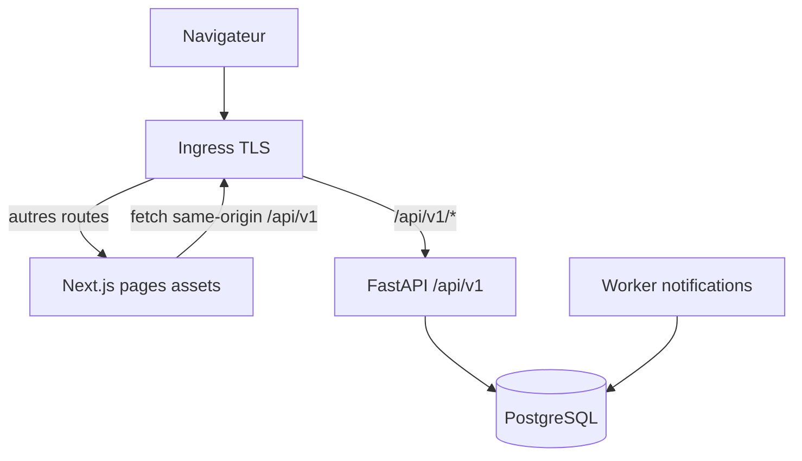

# Architecture spine — THE HIVE LOGISTICS V1

| Champ | Valeur |
|---|---|
| Version | **0.1.4** |
| Ticket | THL-ARCH-001 / 001A / 001B / 001C / **001D** |
| PRD | v0.1.4 |
| UX | v0.1.3 (Home) |
| Statut | APPROVED_FOR_IMPLEMENTATION |
| Style | Monolithe modulaire, same-origin PROD |
| Gate | `READY_FOR_API_ARCHITECTURE = YES` (PRD) |

## 1. Objectif

Architecture implémentable : Next.js + FastAPI + PostgreSQL + worker, sans microservices V1.

## 2. Monorepo cible (documentaire)

Voir ADR-001. Aucun scaffold applicatif dans THL-ARCH-001.

## 3. Stack baseline

Node 24 LTS ; Next.js 16 App Router ; TS strict ; Tailwind 4 ; Python 3.13/uv/FastAPI/Pydantic 2/SQLAlchemy 2/Alembic/psycopg3 ; PostgreSQL 18.

## 4. Topologie same-origin

- **PROD :** même domaine public pour HTML et API.
- **Next.js n’est pas un BFF obligatoire** ; pas de logique métier lead dans Route Handlers.
- **Rewrite/proxy Next→API : DEV uniquement.**

## 5. Composants

| Composant | Rôle |
|---|---|
| Ingress | Routage `/api/v1/*` → FastAPI ; TLS ; limites body 64 KiB |
| Next.js | UI, RSC, formulaires client, Turnstile widget |
| FastAPI | Contrats publics, pipeline ADR-004, transactions |
| Worker | `notification_jobs` at-least-once |
| PostgreSQL | leads, idempotence, rate limits, jobs |

## 6. Matrice traçabilité MUST (Contact / Devis + infra lead)

| PRD | Composant | Endpoint | Stockage | Contrôle | Test | Doc |
|---|---|---|---|---|---|---|
| FR-003 | web + API | POST quote-requests | quote_request_details | SEC-001 | e2e devis | openapi |
| FR-004 | Pydantic | QuoteRequestCreate | quote_* + CHECK | SEC-001 | oneOf/champs | DATA-MODEL |
| FR-005 | API pipeline | honeypot | aucun lead | SEC-002 | 403 sans Turnstile | ADR-004 |
| FR-006 | API + widget | turnstile_token | non stocké | SEC-003 | action/host 3s | PUBLIC-API-CONTRACT |
| FR-007 | ref service | LeadSubmissionAccepted | leads.public_reference | SEC-005 | regex | openapi |
| FR-008 | web UI | 201/200 | idempotency response_body | SEC-006 | ref = DB | TEST-STRATEGY |
| FR-009 | web | 422 problem errors | — | SEC-006 | axe/clavier | TEST-STRATEGY |
| FR-016 | FastAPI | 2 POST | leads | SEC-012 | drift OpenAPI | ADR-002 |
| FR-017 | Pydantic | — | — | SEC-001 | 422/400 | openapi |
| FR-018 | rate limit svc | both POST | rate_limit_buckets | SEC-004 | 429 both + multi-instance | DATA-MODEL §6 |
| FR-019 | Alembic | — | all tables | SEC-018 | migration tests | DATA-MODEL |
| FR-020 | config/env | — | DB isolée/env | SEC-018 | env guard | ENVIRONMENTS |
| FR-025 | web /contact + API | POST contact-messages | contact_message_details | SEC-* | sans champs devis | openapi |
| FR-026 | worker | — | notification_jobs | SEC-014 | at-least-once reclaim | ADR-003 |
| FR-032 | web | — | — | — | lien clavier | UX |
| FR-043 | idempotency | Idempotency-Key | idempotency_records | SEC-017 | concurrence PG | PUBLIC-API-CONTRACT |
| FR-044 | Pydantic | ContactSubject enum | contact_message_details.subject | SEC-001 | enum test | openapi |
| FR-046 | ops runbook | — | leads read-only | SEC-010 | runbook Kyria | PRD |
| FR-033 | health | GET health/* | — | SEC-007 | no secrets | openapi |
| NFR-SEC-003 | limiter | both POST | rate_limit_buckets | SEC-004 | dual 429 | TEST-STRATEGY |
| DEC-005–008 | — | — | — | — | contract tests | PRD + openapi |

## 7. Documents

ARCHITECTURE-SPINE, DATA-MODEL, PUBLIC-API-CONTRACT, SECURITY-THREAT-MODEL, ENVIRONMENTS, TEST-STRATEGY, ADR-001…007, `contracts/openapi/openapi.yaml`.

## 8. TBD produit

Non fermés. Format `[À CONFIRMER — Owner: … — Gate: …]` dans docs architecture.

## 9. Validations non-régression documentaire (001B)

Voir `TEST-STRATEGY.md` § contrôles : ≥ 25 TM-* ; ENVIRONMENTS autonome (4 sections) ; interdiction phrase « Politiques identiques à v0.1.0 » ; préservation correctifs 001A.

## 10. Suite

Scaffold post-approbation CTO ADR ; `check_openapi_drift.py` en THL-FOUNDATION-001.
